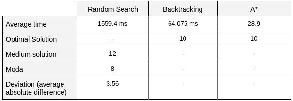

# Introduction to Artificial Intelligence. Assignment 1

## Introduction

In this section I will describe the assumptions that I have made. None of them contradicts the rules mentioned in the assignment description.

- touchdowns’, orcs’, and humans’ positions are within borders of the map. if some position is said to be out of the map it will not be noticed during the game but it also will not affect the game
- handing the ball off is not counted as an attempt to pass it. E. g., situation: I never attempted to pass the ball, I’m at the cell (x, y), human is at the cell (x+1, y), and I hand the ball off to this human. Ball is passed to the human and I continue moving from (x+1, y) but cost of this move was 0
- at least one touchdown is available. touchdown that has an orc at it is not available
- all maps are build so that starting position is always (0, 0) but it can be changed easily in the knowledge base
- if size is set to be *size(N, M)* then the largest available *X* coordinate is *N-1* and largest available *Y* coordinate is *M-1*
- you can find a variable called *TossFlag* in all algorithms. If this flag is 0 then ball toss never never happened, so it can happen in the future. If it is 1 then ball toss succeed at some point and cannot happen again in this branch.

## Random Search Algorithm

The first algorithm that I’ve implemented is Random Search. It is restarted 100 times, as stated in the Assignment description and the best solution is taken to the answer. Best solution is the one with the least amount point scored. Random Search does not give an optimal solution since transition from one step to another is random and is not based neither on cost nor heuristic. Note that random search does not check if the cell the human is moving to was visited before or not. The reason behind it is that it can simply get stuck somewhere and be surrounded by the cells it already visited. Therefore, the resulting solution might give duplicates in the path (which is fine, since, as I mentioned, this algorithm does not produce an optimal solution).

The only parts in Random Search that are not random is that if human sees a touchdown within 1 yard around, human will go right there. And, analogically, if human sees an orc, human will not go there. The reason why I can do so is that even in random search is the ability to see within one yard.

Random search is available for review in *random_search.pl* with comments for each function.

## Backtracking Algorithm

Second algorithms is a Backtracking Algorithm. Since Prolog has a built-in backtracking tree, It is used for backtracking. Unlike Random Search, Backtracking gives an optimal solution, since it goes through all possible paths until it finds the touchdown, therefore, takes a lot of time. My backtracking is a bit faster because I added *is_visited*() function so that it does not try to visit the same cells that were already visited in the current branch. 

The way I build he tree is with the help of *PointsLimit* variable. We could call it a depth limit of a backtracking tree, but since some moves have cost 0, it limits not depth but overall score. First, we try to score 1. Then we try to score 2, 3, ..., etc., until we actually find an optimal solution. It will be optimal because it will have the smallest amount of points.

Backtracking algorithm is available for review in *backtrack.pl*

## A* Algorithm

The third algorithms is A* Algorithm which uses a notion of Opened and Closed sets. It also gives an optimal solution, since each transition from one step to another has assigned cost. I did not implement any heuristic for this algorithm, since we can see only 1 yard around (and attempt to throw the ball), and our cost is already based on it. We could use notion of memory and go through the map first, build it and then base our heuristic on the built map, but it is out of the scope of A* Algorithm.

Let me shortly explain how I implemented it. One record keeps: *(X, Y), cost, path, tossflag*. *Tossflag* is a flag that makes sure that human made only 1 successful toss of the ball during the game. There are two lists: *Closed* and *Opened*. *Opened* contains (sorted by *cost* in ascending order) records that were never processed yet. *Closed* contains processed records that were processed and will never ever be processed again. At each transition first record from *Opened* is taken and processed, all its neighbours that are in none of the lists (*Opened, Closed*) are put in *Opened* with some *cost* assigned. Note that *cost* is either 0 or 1, since all moves are equal besides the one when we hand the ball off. So, since we always process record with the least *cost*, and put them in *Closed*, *Closed* is sorted by cost in descending order. When we reached the touchdown and we need to return the optimal solution, we take the left-most record from *Closed* such that its position *(X, Y)* is the same as one of touchdown’s position.

A* algorithm is available for review in *a_star.pl*

## Comparison

### Comparison of Random Search, Backtracking and A*

The picture below represents the map that was used to create statistical data. It contains only 1 touchdown and no other distractions such as humans or orcs, because their existance might help to find the touchdown. For example, backtracking algorithm can not consider some branches if there is an orc. This map will allow us to test the pure algorithms and the time they require to find a touchdown.

This map can be found in *map/mapSTAT/map11.pl*

From the table we can see that Random Search (with restart) did not give us an optimal solution neither on average nor it did not appear as moda. Also, we clearly see that Random Search takes a lot more time to find the path. A* showed itself as the best algorithm for an empty map.

### Comparison of Backtracking and A*

#### Empty map

The picture below represents the map that I used to compare Backtracking and A*. The map is empty for the same reason as previously. It does not matter if map changes size or we keep it 15\*15 and just move a touchdown, because both Backtracking and A\* expand in a bredth-first manner.

The idea is to run both algorithms but for different touchdowns: T1 (3, 3), T2 (6, 6), T3 (9, 9), T4 (12, 12), T5 (14, 14). Important to mention that Backtracking was able to run for T4 and T5, at least on my laptop. For each algorithm, I made 10 runs. 

From the table above, we can clearly see that Backtracking execution time will grow exponentially, while A* remains its execution time around 40 ms.

#### Map filled with orcs

As another example, I created a map with a lot of orcs.

As we can see, A* won again, even though both algorithms give the optimal solution. 

## Advanced vision

Unfortunately, I did not implement advanced vision and have no statistics to present yet I have some thoughts on the topic.

Random search will not give an optimal solution if we just let the human 2 yards ahead. Human will see a touchdown from 2 yards away, but it will not impove the time on average.

Backtracking cannot benefit too much from this improvement because the only thing it can do is to move to the touchdown faster. As it is now, it attempts to throw the ball every move to every possible human.

My A* algorithm will not perform better with an improved vision because the record will be the same and cost will be assigned the same way. The only thing that could probably improve A* is to implement a heuristic as an amount of points we score to get there from our current position. This heuristic will give a lower bound - yes, but it will not be a good heuristic, since it can be 0.

In general, for small maps (such as 10\*10 - 20\*20), none of the algorithms will perfome very much better.

As I said, for my implementation, I cannot come up with a map that is not solvable with vision 1 yard ahead but is solvable with vision 2 yards ahead, since 1) if touchdown is reachable it will be reached sooner or later and 2) human will not human another human faster with the new vision, since as now, as then it will continue attempting to throw the ball at each move.

## Unsolvable and Difficult Maps

**Unsolvable** maps must be constructed in such a way that touchdown is isolated, e.g., surrounded by orcs:

Even though maps 2\*2 are not a problem for any of the algorithms, if we play according to the rules of our game, touchdown is unreachable. So, Backtracking and A\* will return *false* but Random Search will get stuck, keeping to move until stack exceeds.

**Difficult** maps may be different. For example, for Random Search and Backtracking it must be a large (possibly, empty) map. It will take a lot of time to find a touchdown. For A* - it must be a large map filled with a lot of humans and orcs so that it maintains large lists and processes a lot of states to find a good path. I would see how A* works with maps that have more than 2 dimensions. 